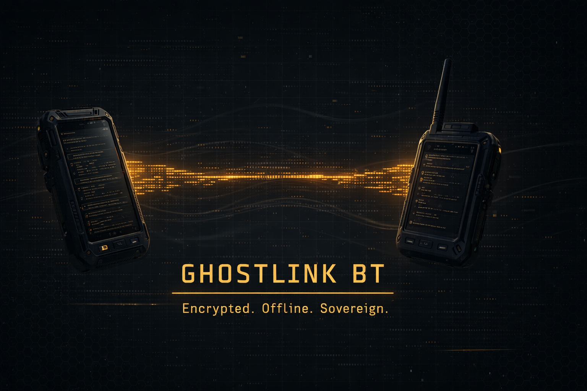

# GhostLink BT (Ghost Protocol V1)

  

A professional, secure, and standalone Peer-to-Peer (P2P) chat application designed for off-grid communication via Bluetooth RFCOMM. Built for Windows, packaged as a single portable executable.



## 🎯 The Mission — Air-Gapped Calibration Companion

**GhostLink BT** was designed as a secure communication channel between a calibration PC (offline) and an auxiliary PC (online) without compromising the critical environment.

In ECU remapping, an unexpected internet connection can:

- Force driver updates.
- Block cloned hardware.
- Corrupt firmware.
- Introduce interference during the writing process.
- Increase the risk of bricking.

**GhostLink BT** allows you to:

- **Keep the tuning PC** completely isolated.
- **Consult documentation or AI** from a second machine.
- **Transfer messages** without exposing the critical environment to the network.

## ⚙️ Why It Exists

- **Air-Gap Friendly**: Tailored for ECU remapping environments and sensitive tools.
- **No Network Stack Exposure**: No WiFi. No Ethernet. No Cloud.
- **Stable Tuning Environment**: Minimizes risk of driver conflicts and software lockouts.
- **Portable**: Runs directly from a USB stick with no installation required.

## 🛠️ Practical Use Case

**PC A — Tuning Machine (Offline)**

- WinOLS / KESS / KTAG
- OpenPort / Sensitive Drivers

**PC B — Research Machine (Online)**

- AI / Technical Forums
- Documentation

_GhostLink BT bridges both worlds without breaking the air-gap isolation._

## 🔐 Security Philosophy

- **No remote execution.**
- **No file execution transfer.**
- **No background services.**
- **No auto-update.**
- **No telemetry.**

## ⚡ Key Features

- **RFCOMM Core**: Built on native Windows Bluetooth sockets (no complex drivers needed).
- **Secure Protocol**: Custom framing with SHA-256 integrity verification.
- **Rich Media**: Support for text and images (Clipboard / Drag & Drop support).
- **Resilient**: Intelligent auto-reconnection logic and robust error handling.
- **Stealth UI**: "Tactical Stealth" visual theme with retro-hacker aesthetics.

## 🏗️ Tech Stack

- **Language**: Python 3.11+
- **GUI Framework**: PySide6 (Qt)
- **Cryptography**: `cryptography` (AES-256 / Fernet)
- **Image Processing**: Pillow (PIL)
- **Build System**: PyInstaller (One-File EXE)

## 🚀 Installation & Usage

### Option A: Portable Executable (Recommended)

1.  Download `GhostLinkBT.exe` from the Releases page (or `dist/` folder).
2.  Launch it on **PC A** (Host) and **PC B** (Client).
3.  On **PC A**, click **[ HOST SESSION ]**.
4.  On **PC B**, click **[ JOIN SESSION ]** and enter the MAC Address of the host machine.

### Option B: Running from Source

1.  Clone the repository:

    ```bash
    git clone https://github.com/jaimemorenoo1/ghostlink-bt.git
    cd ghostlink-bt
    ```

2.  Set up the environment:

    ```bash
    python -m venv venv
    .\venv\Scripts\activate
    pip install -r requirements.txt
    ```

3.  Launch the app:
    ```bash
    python run.py
    ```

## 🏗️ Building the Executable

To generate the standalone `.exe` yourself:

1.  Run the automated build script:
    ```bash
    .\build_exe.bat
    ```
2.  The executable will be generated at `dist\GhostLinkBT.exe`.

---

**Developed by @jaimemorenoo1** // _Stellaris Code // Ghost Protocol V1_
# GhostLink-BT
